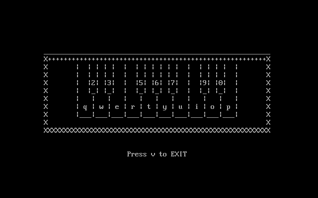

# ASVr Piano

## Brief Description
Virtual Piano with ASCII based GUI by Enveriesage Studios written in x86 Assembly Language.

### Instalation Guide
1. Download `TASM` and `DOS BOX`.
2. Copy `sc` into TASM Files.
3. Compile and Run.

### Documentation
 
